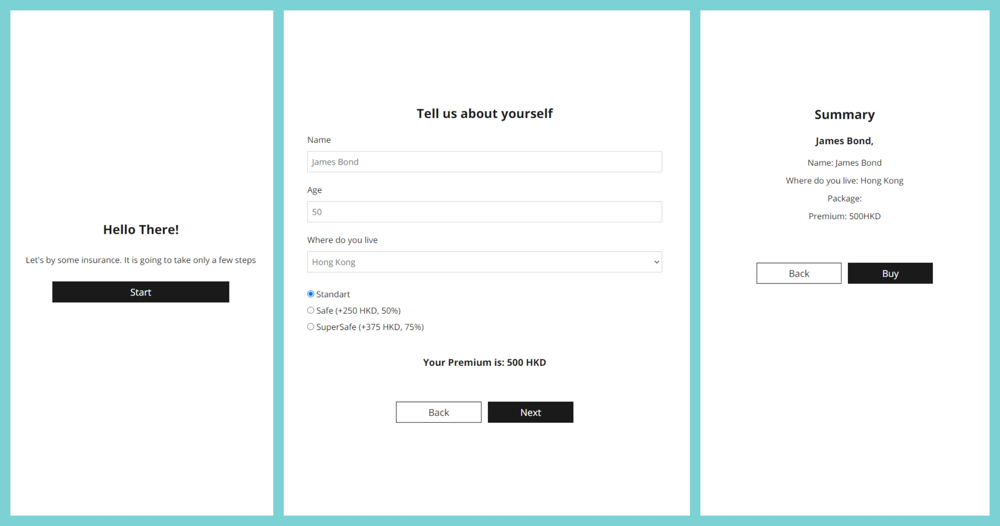

<p align="center">
  <a href="" rel="noopener">
 </a>
</p>

<h3 align="center">multi-step-form-app</h3>

<div align="center">

[]()
[](https://github.com/kylelobo/The-Documentation-Compendium/issues)
[](https://github.com/kylelobo/The-Documentation-Compendium/pulls)
[](/LICENSE)

</div>

---

<p align="center"> This is a multi-step form (wizard) SPA web application where User can fill in information, get price and buy an insurance policy
    <br> 
</p>

## 📝 Table of Contents

- [About](#about)
- [Getting Started](#getting_started)
- [Deployment](#deployment)
- [Usage](#usage)
- [Built Using](#built_using)
- [TODO](../TODO.md)
- [Contributing](../CONTRIBUTING.md)
- [Authors](#authors)
- [Acknowledgments](#acknowledgement)

## 🧐 About <a name = "about"></a>

	The purpose of this project is creating light convenient multi step form to give the the User ability to choose and buy different insurance packages.
	This application was created with Vue 3 framework. Vue is very lightweight, flexible performant and versatile framework for building web applications.
	The process of purchasing insurance is divided into three stages, one page for each. User can navigate from one page to another by clicking on buttons. To provide this vue-router is used.
	On the fisrst start page User can click on the 'Start' button and start the wizard
	On the second page User should fill in name and age, select country and package. On this page, user can also see calculated Premium value in correct currency. User can back from this page and start again or, if everything is appropriate, to click on 'Next' button' and go ti the therd page. If the user entered age above 100 years then he redirects to the error-page.
	On the Third Page, the User can view the resulting information and buy insurance by clicking on the "Buy" button, or return if something needs to be changed.
	The project contains Vue components for pages view. Each page component includes many reusable components to achieve  changeability and scalability. To improve availability we use dynamic imports for pages
	To provide storing and avaibility User information while navigation, we use vuex store.
	

## 🏁 Getting Started <a name = "getting_started"></a>

To test web application locally You should download it from GitHub into local folder on Your computer. See [deployment](#deployment) for notes on how to deploy the project.

### Prerequisites

You need to have Node.JS installed on Your local computer to run this project

### Installing

You should go through the next steps.


```
mpm install
```

Then You can run the project locally

````
npm run serve
````

By default You can open the page with the application in Your browser at http://localhost:8080/

## 🔧 Running the tests <a name = "tests"></a>

## 🎈 Usage <a name="usage"></a>

Add notes about how to use the system.

## 🚀 Deployment <a name = "deployment"></a>

For deploying You shouls get the bundle by building the project:

````
npm run build
````

## ⛏️ Built Using <a name = "built_using"></a>
- [VueJs](https://vuejs.org/) - Web Framework
- [NodeJs](https://nodejs.org/en/) - For NPM Package manager

## ✍️ Authors <a name = "authors"></a>
itconstructorfrs@gmail.com


